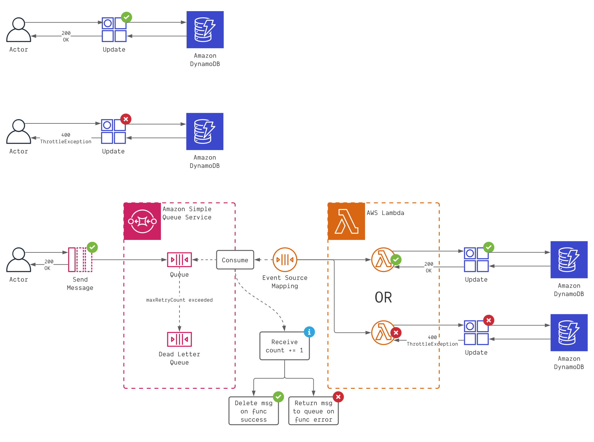

# sqs-to-dynamo



---

# This project was created using CDK for TypeScript

## Prerequisites

`cdk bootstrap aws://<ACCOUNT_NUMBER>/<AWS_REGION>`

## Quickstart

- `touch .env`
- `npx cdk deploy --outputs-file ./cdk-outputs.json`

## Running scripts

- `npx ts-node ./scripts/burst_db.ts 20000`
- `npx ts-node ./scripts/burst_queue.ts 20000`

## CDK Commands

- `npx cdk synth` emits the synthesized CloudFormation template
- `npx cdk diff` compare deployed stack with current state
- `npx cdk deploy --outputs-file ./cdk-outputs.json` deploy this stack to your default AWS account/region
- `npx cdk destroy` delete all provisioned resource (removal policies may prevent deletion in some cases)

## Notes

<details>
  
  <summary>First Deploy requires <code>cdk bootstrap aws://unknown-account/unknown-region</code></summary>

```
➜ npx cdk deploy
Bundling asset SqsToDynamoStack/SqsConsumer/Code/Stage...

  cdk.out/bundling-temp-60b63569b53edba1b83a3e609c2be4a302a87e302e825e530f9b8eafbb7021f4/index.js  1.1mb ⚠️

⚡ Done in 65ms
This deployment will make potentially sensitive changes according to your current security approval level (--require-approval broadening).
Please confirm you intend to make the following modifications:

IAM Statement Changes
┌───┬─────────────────────────────────────┬────────┬─────────────────────────────────────┬──────────────────────────────────────┬───────────┐
│   │ Resource                            │ Effect │ Action                              │ Principal                            │ Condition │
├───┼─────────────────────────────────────┼────────┼─────────────────────────────────────┼──────────────────────────────────────┼───────────┤
│ + │ ${DlQueue.Arn}                      │ Allow  │ sqs:SendMessage                     │ AWS:${SqsConsumer/ServiceRole}       │           │
├───┼─────────────────────────────────────┼────────┼─────────────────────────────────────┼──────────────────────────────────────┼───────────┤
│ + │ ${Queue.Arn}                        │ Allow  │ sqs:ChangeMessageVisibility         │ AWS:${SqsConsumer/ServiceRole}       │           │
│   │                                     │        │ sqs:DeleteMessage                   │                                      │           │
│   │                                     │        │ sqs:GetQueueAttributes              │                                      │           │
│   │                                     │        │ sqs:GetQueueUrl                     │                                      │           │
│   │                                     │        │ sqs:ReceiveMessage                  │                                      │           │
├───┼─────────────────────────────────────┼────────┼─────────────────────────────────────┼──────────────────────────────────────┼───────────┤
│ + │ ${SqsConsumer/ServiceRole.Arn}      │ Allow  │ sts:AssumeRole                      │ Service:lambda.amazonaws.com         │           │
├───┼─────────────────────────────────────┼────────┼─────────────────────────────────────┼──────────────────────────────────────┼───────────┤
│ + │ ${Table.Arn}                        │ Allow  │ dynamodb:BatchGetItem               │ AWS:${SqsConsumer/ServiceRole}       │           │
│   │                                     │        │ dynamodb:BatchWriteItem             │                                      │           │
│   │                                     │        │ dynamodb:ConditionCheckItem         │                                      │           │
│   │                                     │        │ dynamodb:DeleteItem                 │                                      │           │
│   │                                     │        │ dynamodb:GetItem                    │                                      │           │
│   │                                     │        │ dynamodb:GetRecords                 │                                      │           │
│   │                                     │        │ dynamodb:GetShardIterator           │                                      │           │
│   │                                     │        │ dynamodb:PutItem                    │                                      │           │
│   │                                     │        │ dynamodb:Query                      │                                      │           │
│   │                                     │        │ dynamodb:Scan                       │                                      │           │
│   │                                     │        │ dynamodb:UpdateItem                 │                                      │           │
└───┴─────────────────────────────────────┴────────┴─────────────────────────────────────┴──────────────────────────────────────┴───────────┘
IAM Policy Changes
┌───┬────────────────────────────┬────────────────────────────────────────────────────────────────────────────────┐
│   │ Resource                   │ Managed Policy ARN                                                             │
├───┼────────────────────────────┼────────────────────────────────────────────────────────────────────────────────┤
│ + │ ${SqsConsumer/ServiceRole} │ arn:${AWS::Partition}:iam::aws:policy/service-role/AWSLambdaBasicExecutionRole │
└───┴────────────────────────────┴────────────────────────────────────────────────────────────────────────────────┘
(NOTE: There may be security-related changes not in this list. See https://github.com/aws/aws-cdk/issues/1299)

Do you wish to deploy these changes (y/n)? y
SqsToDynamoStack: deploying...

 ❌  SqsToDynamoStack failed: Error: This stack uses assets, so the toolkit stack must be deployed to the environment (Run "cdk bootstrap aws://unknown-account/unknown-region")
    at Object.addMetadataAssetsToManifest (/Users/kevin/repos/sqs-to-dynamo/node_modules/aws-cdk/lib/assets.ts:27:11)
    at Object.deployStack (/Users/kevin/repos/sqs-to-dynamo/node_modules/aws-cdk/lib/api/deploy-stack.ts:229:29)
    at processTicksAndRejections (node:internal/process/task_queues:96:5)
    at CdkToolkit.deploy (/Users/kevin/repos/sqs-to-dynamo/node_modules/aws-cdk/lib/cdk-toolkit.ts:189:24)
    at initCommandLine (/Users/kevin/repos/sqs-to-dynamo/node_modules/aws-cdk/bin/cdk.ts:225:9)
This stack uses assets, so the toolkit stack must be deployed to the environment (Run "cdk bootstrap aws://unknown-account/unknown-region")
```

</details>
